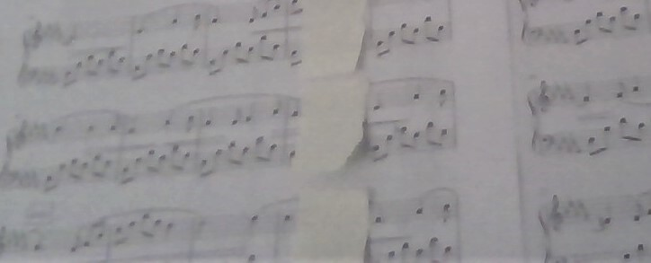
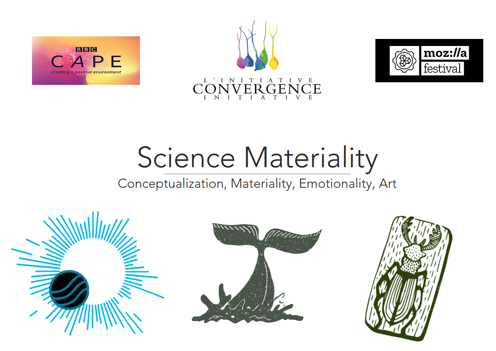

```{r setup}
library(flexdashboard)
library(shiny)
library(DiagrammeR)
```

### the metaphor / art concept, *a created tangible, evocative expression of the scientific abstract* << {data-commentary-width=500}  
{height="300"}
```{r, include=FALSE, eval=FALSE}
#https://stackoverflow.com/questions/59789276/r-flexdashboard-how-to-embed-a-video-with-a-reactive-value-in-file-path
#  
# that works too but won't align and goes over 
#{height=10%} 
```
*** 
the resultant art concept:  
+ a fugue^ punctuated by periodic brief pauses.  respite from the ceaseless tides, shade from the heat or momentum of the continuous sound-field *emissions from the star, interrupted by the orbiting exoplant  passing through its line of contact with us*   
+ the silences are unnatural and create anticipation towards melodic resumption.  Also invites curiosity - questions as to the cause of the silence, pattern-seeking for the disturbance frequency.  Pedal is held as previously sounded tones still carry onward despite the mute blind spots.  *how astronomers search for the exoplanets, deducing from emission disturbances*  
+ + + + +  *thoughts*  
+ overall this probably didn't far removed from the original, unlike the biodiversity -> chorus.  Branching off differently from another of the similes, inkspot -- visually, could use sumigashi with ripples impeded by a marble or leaf  
+ branching off from a different origin, *Subject 3 Biodiversity*, the embroidery or choral concepts with dropping/joining voices would be fascinating to develop  
+ further applicability in anecdotal writings and more generic [science visualization/communication](https://distill.pub/2020/communicating-with-interactive-articles/)  
  
^(didn't have a fugue at hand so used M.Stewart-Evans' [Wander](https://mattstewartevans.com/music/licensing/) which has that fugue-like enveloping momentum...and was conveniently barred for  manual "sticky-note" shading every fourth bar of five.  Recorded roughly on purpose (besides lack of practice for fluidity!) as conceptual sketch, unlicensed; need to replace with fugue)    
{height="160"} 
  
### << **3** materalizing: *from tangibility, sensations, feelings associated with the simile* {data-commentary-width=400}
```{r}
DiagrammeR::grViz("digraph {
graph [rankdir = LR,layout = neato]
node [shape = plaintext,
        fontname = Helvetica]

# edge definitions with the node IDs
'shadow   \n viscerality'  -> {'relaxation; respite \n from momentum', 'purging space, \n carthasis','counterpoints sound \n in melody, \n anticipatory    ', 'refreshing \n banyan canopy \n in summer', 'contrast-companion of light, of substance'}
'shadow \n materiality' -> {mute dark dapple intangible weightless cool}  
}")
```
  
***
Giving substance to the chosen simile (which may itself be as abstract and intangible as the original scientific concept!).  The guiding questions (e.g. how does it feel in hand?  What is the feeling associated with the emotion?) provided by the workshop were well posed, simple and directly useful in shaping the final concept. 

### << **2**  similes mind-mapping: *facilitating divergence, layered distance from the abstract technical concept* {data-commentary-width=400}
```{r}
DiagrammeR::grViz("digraph {
graph [layout = neato]
node [shape = plaintext,
        fontname = Helvetica,
       fontsize = 9.5,
        ]

abstract [label='Temperate Earth-sized \n planets transiting a nearby \n ultracool dwarf star.']

star [label = 'star']
liveorb [label =  'live orb']
heart [label =  'heart']
musicbox [label =  'music box']
sprinkler [label = 'sprinkler']
seed [label= 'seed']

planet [label = 'planet']
accompanying [label =  'accompanying']
necklace [label =  'necklace']
shadow [label = 'shadow']
inkspot [label= 'inkspot']
treeshade [label= 'tree shade']

# edge definitions with the node IDs
abstract -> {star planet}
star  -> {liveorb musicbox sprinkler}
liveorb -> {heart seed}
planet  ->{accompanying shadow}
accompanying -> necklace
shadow -> {inkspot treeshade}
}")
```

*** 
A stimulating and difficult thought activity (within the time constraint of the workshop as well), to try to distance and diverge away from the scientific topic through similes (and trying to reach even further extensions of them).  
Agree with the sentiment expressed in the workshop, that the more & in-depth one knows of one's domain, the harder it is explain what one knows to others.   Why philosophers' own texts oft make for such dense reading perhaps!  

### << **1**  de-jargonize: *condense and simplify the scientific finding, or, plane the abstract plain* {data-commentary-width=400}

```{r}
DiagrammeR::grViz("digraph {
graph [rankdir = LR]
node [shape = plaintext,
        fontname = Helvetica]

abstract [label='Guillon et al. 2016.  \n Temperate Earth-sized \n planets transiting a nearby \n ultracool dwarf star.']

# edge definitions with the node IDs
abstract  -> {'subject: astronomy', 'question: find earth-like planets','question: likely around dwarf stars?', 'how: radiation/emission'}  
}")
```

*** 
Through answering a series of questions, render the scientific abstract into familiar plain language to facilitate communication to laymen.  
  
But this abstract seemed quite plainly written as-is, with not much jargon.  Not much done at this stage (I had also mixed up the background information about star "sound" emissions as being the main topic rather than the actual Guillon et al. paper)  
  
In fact, science in general is fairly simple to understand, given it is grounded in logical reason.  What are really incomprehensible are human hearts, political science(?), government finances, and business machinations...  

### << **0** origin: *the scientific article abstract to be "expressed" or rendered comprehensible* {data-commentary-width=400}
[Subject 1 - Music of the Spheres, **Convergence Intiative Mozfest 2021 workshop**](https://www.convergenceinitiative.org/convergence-scimat-mozilla)  
Guillon et al - Temperate Earth-sized planets transiting a nearby ultracool dwarf star. Nature 533, page 222-227 (2016)  
*Star-like objects with effective temperatures of less than 2,700 k are referred to as ultracool dwarfs. This heterogeneous group includes stars of extremely low mass as well as brown dwarfs (substellar objects not massive enough to sustain hydrogen fusion), and represents about 15 percent of the population of astronomical objects near the Sun. Core-accretion theory predicts that, given the small masses of these ultracool dwarfs, and the small sizes of their protoplanetary disks, there should be a large but hitherto undetected population of terrestrial planets orbiting them, ranging from metal-rich Mercury-sized planets to more hospitable volatile-rich Earth-sized planets. Here we report observations of three short-period Earth-sized planets transiting an ultracool dwarf star only 12 parsecs away. The inner two planets receive four times and two times the irradiation of Earth, respectively, placing them close to the inner edge of the habitable zone of the star. Our data suggest that 11 orbits remain possible for the third planet, the most likely resulting in irradiation significantly less than that received by Earth. The infrared brightness of the host star, combined with its Jupiter-like size, offers the possibility of thoroughly characterizing the components of this nearby planetary system.*   

**Background Information**  
Do stars make sounds? (https://earthsky.org/space/do-stars-make-sounds) 

*** 
{width=50%}  
Mozfest 2021 - this workshop was one of the highlights for me; a mindset-shifter.  
  
Chose subject 1 of 3 being the furthest away from my own field.  (Subjects 2 & 3 being biodiversity and noise impacts on oceanic life - which were also depressing, as seemingly with most topics environmental these days).    
The subject title and background reading also called to the mind the singing well from the *Little Prince*. 


