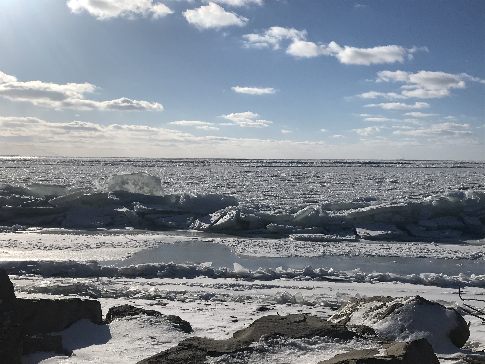
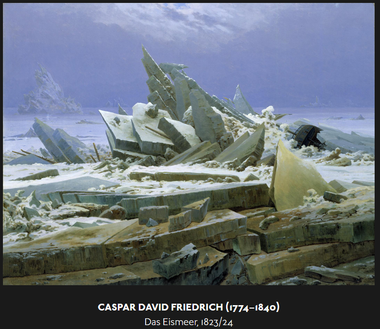
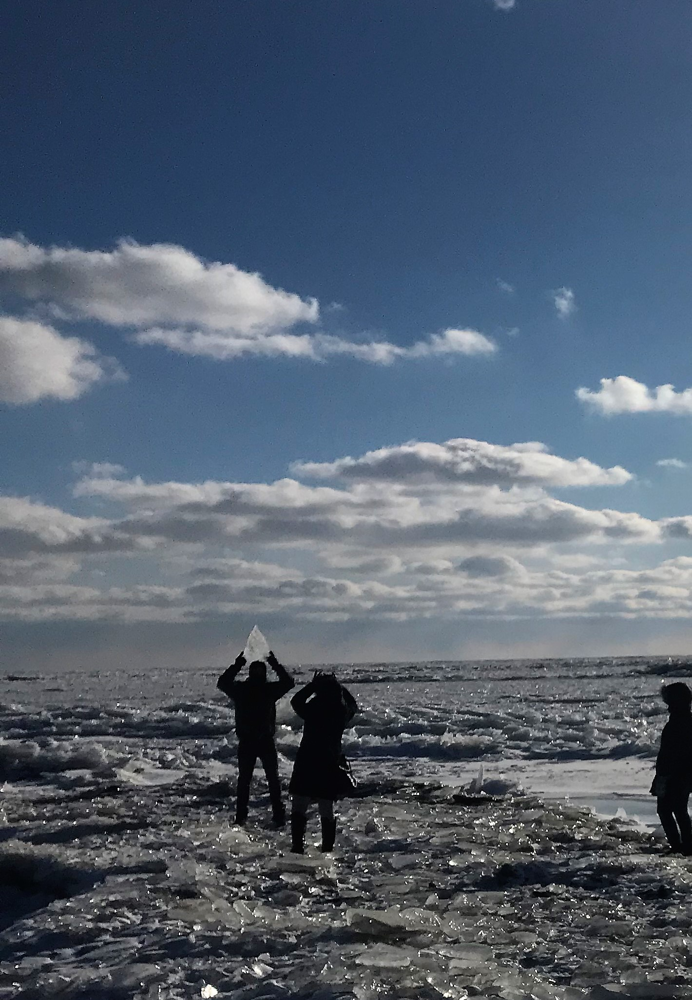
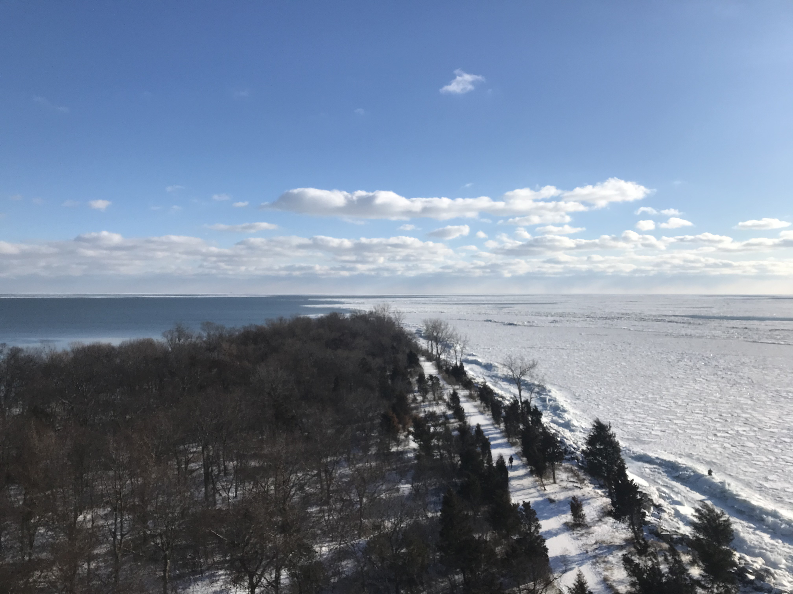

Still some distance from Pelee, the vast snow-laden farm-plains slip behind, and sparse dwellings accrete until they border both sides of the road, blotting up the white-on-blue.

Flitting between houses, the opaque white yonder also whittles out.  Stolen glimpses of silvered sparks alight the south - the iced lake.   Spangling in frosted stasis, inumerable light shards strewed over the frozen expanse through to the paled horizon.A Milky Way descended, glinting fiercer  in sunlit white than midnight monochrome.   
 
So this is where stars bask and repose, radiant.  

The way south to the point extruding to the lake is barely touched by snow, sheltered on either side, unexpectedly, by trees staking a strong stand on a wisp of land so tenuous on the map.  It is winter, so one may drive nearly out to the tip-point.  An observation tower stands at the footpath's start, but is of such heft and jarringness (an *artifice* foreign and irreducible) that it is an absurdity soon negated.  (Though not meant in total slight to its being - alighting it on the way back reveals a telling perspective)  The brambling trees end abruptly into a staid blue, hardly astir through to the soft-hued horizon.  

Turning west, the tree veil recedes to reveal  juxtaposing chaos.  A continuous crest of massive ice-flats - shards of giant's mirror, or a chandelier perhaps - each larger than a raft, piled-up and hedging the entire length of the windward shore.  Caspar David Friedrich's *Polar Sea* , in greater subtlety, alit and pristine.  

[*Source *& seen at*: Hamburger Kunsthalle*](https://www.hamburger-kunsthalle.de/die-kunst-ist-offentlich-deutsch)

It had barely snowed since the morning, and the haphazardly angled ice-slats were flawlessly lucent.  Ice of such scarce time, such youth, it has taken no colour of the world (and will never, here, accrue the time-density of glacial ethereal hue).  The shore-shattered shards lay as a multitde of white down'd slates.  What nature tosses up carelessly at flotsams we can only perceive in awe, and conceive in much diminished forms as aping lapidaries.  The inhuman beauty, in its glassy denseness and brilliant intensity, envelopes and negates us. 

----------

*With frost nipping nose and fingers, a hasty ascent up the tower for a* parting *shot.*

## Bibliography
Camus, Albert. *The Myth of Sisyphus* trans. Justin O'Brien (London: Hamish Hamilton, 1973)  
Macfarlane,Robert. *Underland*  (London: Hamish Hamilton, 2019)  
董其昌.various works. National Palace Museum. <https://theme.npm.edu.tw/exh105/dongqichang/ch/index.html>  
Friedrich,Caspar David. *Das Eismeer*. Hamburger Kunsthalle <https://www.hamburger-kunsthalle.de/die-kunst-ist-offentlich-deutsch>