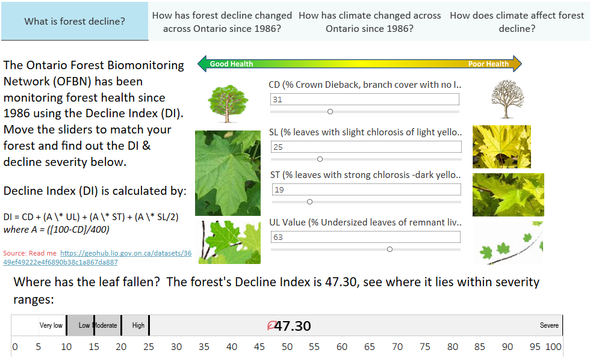
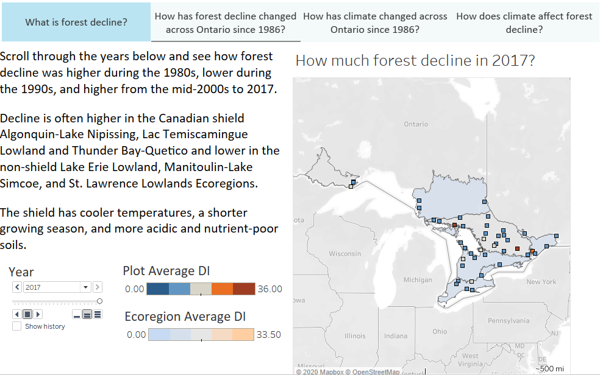
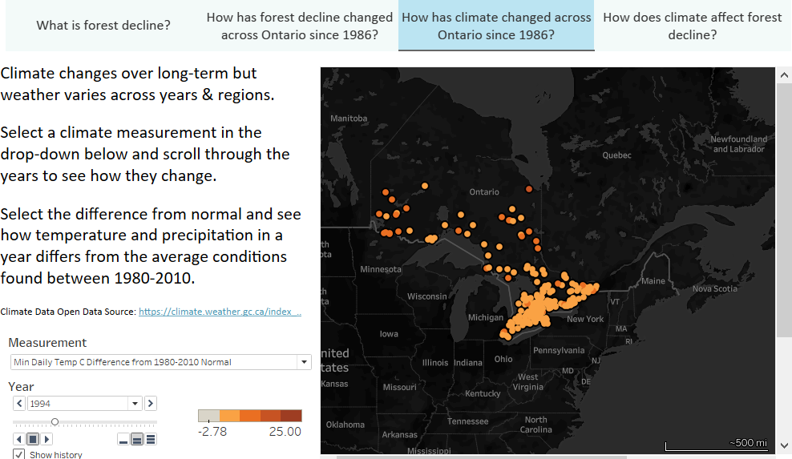
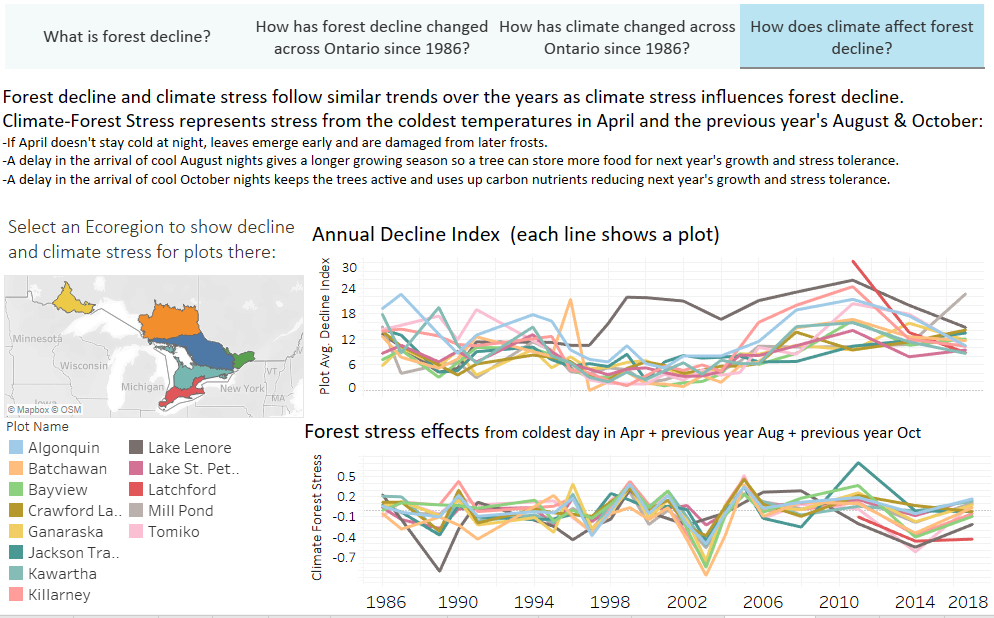
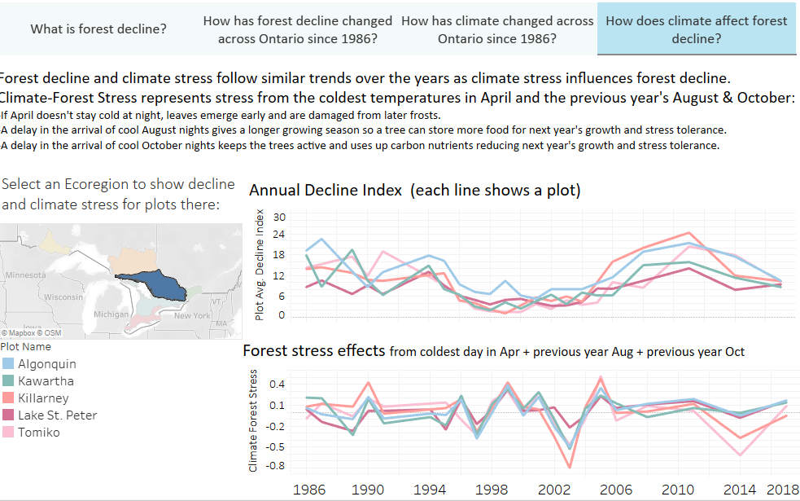

# The Look
* Features
  + interactive manipulation of the forest Decline Index formula
  + mapped forest plots and climate stations 
  + eco-regional trending
[References, approach and data pre-processing documentation](https://jjyh.github.io/hackathon-OFBN/)
  





  
* Lessons Learnt (personal opinions)- the platform
  + DOA outside of specific server environment (not standalone file), very slow to render
  + no provision for collaboration or version control in this version
  + needed heavy wrangling outside of software esp. for GIS
  + GUI presents a challenge to share/reproduce, requiring animated GIF captures
  + a lot of "tricking" the system required, lack of fine control and unclear parsing (overcome by training?)
  
```{r setup, include=FALSE}
knitr::opts_chunk$set(echo = FALSE)
```


